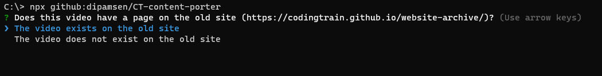
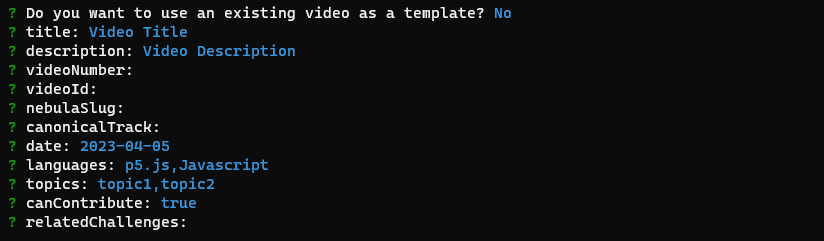
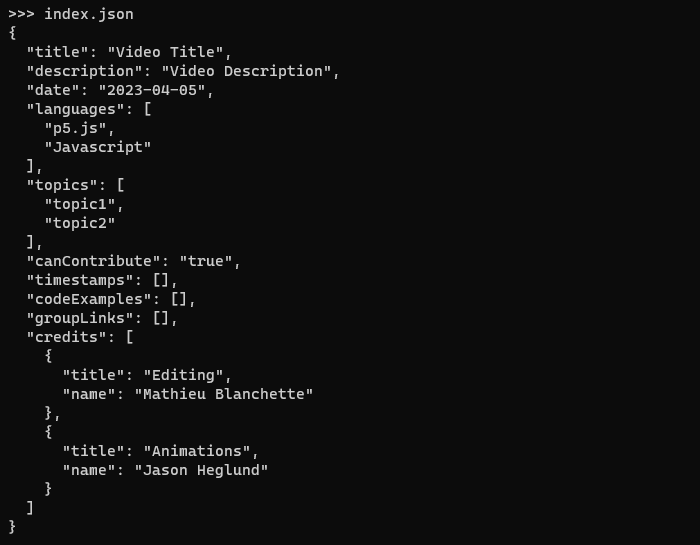
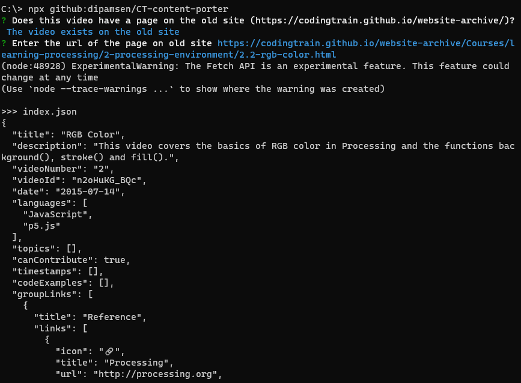

# Coding Train Website - `index.json` template

This script helps in generating a basic template for `index.json` files for creating videos for the Coding Train website.





## Usage

The script can directly be run from the command line with `npx`:

```bash
npx github:dipamsen/CT-content-porter
```

> For using an existing video as a template, you need to add a GITHUB_TOKEN environment variable in the `.env` file with a valid GitHub token.
>
> ```
> GITHUB_TOKEN=your_token_here
> ```

## Screenshots

### Creating new video




### Porting existing video (from old website)


